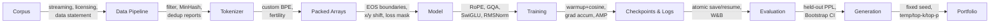
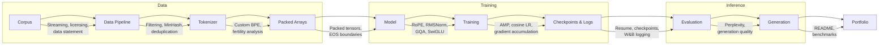

# nano-llm-pretrain

```mermaid
flowchart LR
    A[Corpus]
    B[Data Pipeline]
    C[Tokenizer]
    D[Packed Arrays]
    E[Model]
    F[Training]
    G[Checkpoints & Logs]
    H[Evaluation]
    I[Generation]
    J[Portfolio]

    A -->|streaming, licensing,<br/>data statement| B
    B -->|filter, MinHash,<br/>dedup reports| C
    C -->|custom BPE,<br/>fertility| D
    D -->|EOS boundaries,<br/>x/y shift, loss mask| E
    E -->|RoPE, GQA,<br/>SwiGLU, RMSNorm| F
    F -->|warmup+cosine,<br/>grad accum, AMP| G
    G -->|atomic save/resume,<br/>W&B| H
    H -->|held-out PPL,<br/>Bootstrap CI| I
    I -->|fixed seed,<br/>temp/top-k/top-p| J
```

```mermaid
flowchart LR

subgraph Data
A[Corpus]
B[Data Pipeline]
C[Tokenizer]
D[Packed Arrays]
end

subgraph Training
E[Model]
F[Training]
G[Checkpoints & Logs]
end

subgraph Inference
H[Evaluation]
I[Generation]
end

J[Portfolio]

A --> B
B --> C
C --> D
D --> E
E --> F
F --> G
G --> H
H --> I
I --> J

A -- "Streaming, licensing,<br/>data statement" --> B
B -- "Filtering, MinHash,<br/>deduplication" --> C
C -- "Custom BPE,<br/>fertility analysis" --> D
D -- "Packed tensors,<br/>EOS boundaries" --> E
E -- "RoPE, RMSNorm,<br/>GQA, SwiGLU" --> F
F -- "AMP, cosine LR,<br/>gradient accumulation" --> G
G -- "Resume, checkpoints,<br/>W&B logging" --> H
H -- "Perplexity,<br/>generation quality" --> I
I -- "README,<br/>benchmarks" --> J
```
