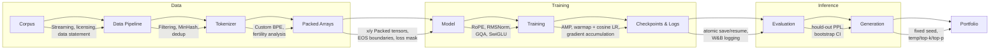

# nano-llm-pretrain

```mermaid
flowchart LR

subgraph Data
A[Corpus]
B[Data Pipeline]
C[Tokenizer]
D[Packed Arrays]
end

subgraph Training
E[Model]
F[Training]
G[Checkpoints & Logs]
end

subgraph Inference
H[Evaluation]
I[Generation]
end

J[Portfolio]

A --> B
B --> C
C --> D
D --> E
E --> F
F --> G
G --> H
H --> I
I --> J

A -- "Streaming, licensing,<br/>data statement" --> B
B -- "Filtering, MinHash,<br/>dedup" --> C
C -- "Custom BPE,<br/>fertility analysis" --> D
D -- "x/y Packed tensors,<br/>EOS boundaries, loss mask" --> E
E -- "RoPE, RMSNorm,<br/>GQA, SwiGLU" --> F
F -- "AMP, warmap + cosine LR,<br/>gradient accumulation" --> G
G -- "atomic save/resume,<br/>W&B logging" --> H
H -- "hould-out PPL,<br/>bootstrap CI" --> I
I -- "fixed seed,<br/>temp/top-k/top-p" --> J
```
