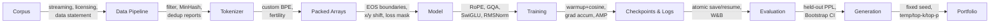

# nano-llm-pretrain

```mermaid
flowchart LR
    A[Corpus]
    B[Data Pipeline]
    C[Tokenizer]
    D[Packed Arrays]
    E[Model]
    F[Training]
    G[Checkpoints & Logs]
    H[Evaluation]
    I[Generation]
    J[Portfolio]

    A -->|streaming, licensing,<br/>data statement| B
    B -->|filter, MinHash,<br/>dedup reports| C
    C -->|custom BPE,<br/>fertility| D
    D -->|EOS boundaries,<br/>x/y shift, loss mask| E
    E -->|RoPE, GQA,<br/>SwiGLU, RMSNorm| F
    F -->|warmup+cosine,<br/>grad accum, AMP| G
    G -->|atomic save/resume,<br/>W&B| H
    H -->|held-out PPL,<br/>Bootstrap CI| I
    I -->|fixed seed,<br/>temp/top-k/top-p| J
```
