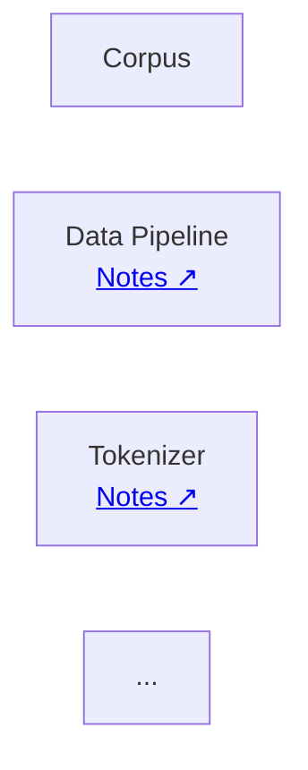

# nano-llm-pretrain

```mermaid
flowchart LR

subgraph Data
A[Corpus]
B[Data Pipeline]
C[Tokenizer]
D[Packed Arrays]
end

subgraph Training
E[Model]
F[Training]
G[Checkpoints & Logs]
end

subgraph Inference
H[Evaluation]
I[Generation]
end

J[Portfolio]

A --> B
B --> C
C --> D
D --> E
E --> F
F --> G
G --> H
H --> I
I --> J

A -- "Streaming, licensing,<br/>data statement" --> B
B -- "Filtering, MinHash,<br/>dedup" --> C
C -- "Custom BPE,<br/>fertility analysis" --> D
D -- "x/y Packed tensors,<br/>EOS boundaries, loss mask" --> E
E -- "RoPE, RMSNorm,<br/>GQA, SwiGLU" --> F
F -- "AMP, warmap + cosine LR,<br/>gradient accumulation" --> G
G -- "atomic save/resume,<br/>W&B logging" --> H
H -- "hould-out PPL,<br/>bootstrap CI" --> I
I -- "fixed seed,<br/>temp/top-k/top-p" --> J
```

## Architecture

End-to-end LLM pretraining pipeline, pure PyTorch, no transformers import in model/train code.





> **Pipeline overview (text version)**


```text
Corpus
  │
  ▼
Data Pipeline
  ├── Streaming
  ├── Filtering
  ├── MinHash Deduplication
  └── Data Statement
  │
  ▼
Tokenizer
  ├── Custom BPE
  └── Fertility Analysis
  │
  ▼
Packed Arrays
  ├── EOS Boundaries
  └── x/y Tensors
  │
  ▼
Model
  ├── RoPE
  ├── RMSNorm
  ├── GQA
  └── SwiGLU
  │
  ▼
Training
  ├── AMP
  ├── Cosine LR
  └── Gradient Accumulation
  │
  ▼
Checkpoints & Logs
  ├── Atomic Save/Resume
  └── Weights & Biases
  │
  ▼
Evaluation
  ├── Perplexity
  └── Sample Generation
  │
  ▼
Generation
  ├── Temperature
  ├── Top-k
  └── Top-p
  │
  ▼
Portfolio
  ├── README
  ├── Benchmarks
  └── Technical Write-up
```


# Engineering Decisions

## Data Pipeline

- Use FineWeb instead of FineWeb-Edu.
- MinHash threshold = 0.85.
- ...

## Tokenizer

- Vocabulary = 32k.
- Normalization = NFC.
- ...

## Packed Arrays

- Sequence length = 1024.
- EOS between documents.
- ...

## Model

- RoPE
- RMSNorm
- GQA
- SwiGLU

## Training

- bf16
- Cosine LR
- Warmup = 2000 steps
- ...





## Model Architecture

```
Input IDs
    │
    ▼
Token Embedding
    │
    ▼
┌──────────────────────────┐
│ Decoder Block × 12       │
│  • RMSNorm               │
│  • GQA + RoPE            │
│  • FeedForward           │
│  • Residual Connections  │
└──────────────────────────┘
    │
    ▼
Final RMSNorm
    │
    ▼
LM Head
    │
    ▼
Vocabulary Logits
```

| Component | Value |
|-----------|------:|
| Vocabulary | 16,000 |
| Context length | 1024 |
| Decoder blocks | 12 |
| Hidden dimension | 768 |
| Query heads | 12 |
| KV heads | 4 |
| Head dimension | 64 |
| FFN multiplier | 4 |
| Normalization | RMSNorm |
| Gated activations | SwiGLU |
| Positional encoding | RoPE |
| Attention | Grouped Query Attention |
| Inference | KV Cache |
| Sampling | Greedy / Temperature / Top-k / Top-p |


## Resume Training

Training can be resumed from any saved checkpoint.

Resume from the latest checkpoint:

```bash
python train.py \
    --config configs/train.yaml \
    --resume runs/<run_name>/latest.pt
```

Resume from the best validation checkpoint:

```bash
python train.py \
    --config configs/train.yaml \
    --resume runs/<run_name>/best.pt
```

For smoke tests:

```bash
python train.py \
    --config configs/smoke.yaml \
    --resume runs/<run_name>/latest.pt
```

When resuming, the training state is restored, including:

* Model weights
* Optimizer state
* GradScaler state (when enabled)
* Training step
* Best validation loss
* CPU/GPU RNG state

This allows training to continue from the previous checkpoint without restarting optimization.


## Generate text

Generate text from a trained checkpoint:

```bash
python sample.py \
    --checkpoint runs/<run_name>/best.pt \
    --prompt "Once upon a time" \
    --max_new_tokens 200 \
    --temperature 0.8 \
    --top_k 50
```

Or use the latest checkpoint:

```bash
python sample.py \
    --checkpoint runs/<run_name>/latest.pt \
    --prompt "The future of AI is"
```