# nano-llm-pretrain

```mermaid
flowchart LR

subgraph Data
A[Corpus]
B[Data Pipeline]
C[Tokenizer]
D[Packed Arrays]
end

subgraph Training
E[Model]
F[Training]
G[Checkpoints & Logs]
end

subgraph Inference
H[Evaluation]
I[Generation]
end

J[Portfolio]

A --> B
B --> C
C --> D
D --> E
E --> F
F --> G
G --> H
H --> I
I --> J

A -- "Streaming, licensing,<br/>data statement" --> B
B -- "Filtering, MinHash,<br/>dedup" --> C
C -- "Custom BPE,<br/>fertility analysis" --> D
D -- "x/y Packed tensors,<br/>EOS boundaries, loss mask" --> E
E -- "RoPE, RMSNorm,<br/>GQA, SwiGLU" --> F
F -- "AMP, warmap + cosine LR,<br/>gradient accumulation" --> G
G -- "atomic save/resume,<br/>W&B logging" --> H
H -- "hould-out PPL,<br/>bootstrap CI" --> I
I -- "fixed seed,<br/>temp/top-k/top-p" --> J
```

## Architecture

End-to-end LLM pretraining pipeline, pure PyTorch, no transformers import in model/train code.





> **Pipeline overview (text version)**


```text
Corpus
  │
  ▼
Data Pipeline
  ├── Streaming
  ├── Filtering
  ├── MinHash Deduplication
  └── Data Statement
  │
  ▼
Tokenizer
  ├── Custom BPE
  └── Fertility Analysis
  │
  ▼
Packed Arrays
  ├── EOS Boundaries
  └── x/y Tensors
  │
  ▼
Model
  ├── RoPE
  ├── RMSNorm
  ├── GQA
  └── SwiGLU
  │
  ▼
Training
  ├── AMP
  ├── Cosine LR
  └── Gradient Accumulation
  │
  ▼
Checkpoints & Logs
  ├── Atomic Save/Resume
  └── Weights & Biases
  │
  ▼
Evaluation
  ├── Perplexity
  └── Sample Generation
  │
  ▼
Generation
  ├── Temperature
  ├── Top-k
  └── Top-p
  │
  ▼
Portfolio
  ├── README
  ├── Benchmarks
  └── Technical Write-up
```
