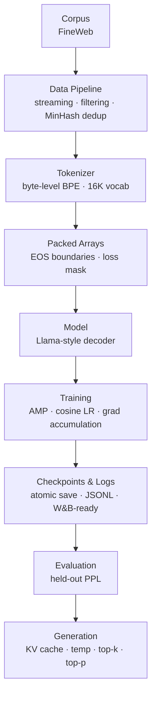

# nano-llm-pretrain

> End-to-end decoder-only LLM pretraining in pure PyTorch — data ingestion, MinHash deduplication, BPE tokenization, Llama-style architecture (RoPE / RMSNorm / SwiGLU / GQA), training, evaluation, and generation, built from scratch with no `transformers` import in model or training code.

[](https://www.python.org/)
[](https://pytorch.org/)
[](LICENSE)
[](#status)

---

## Table of Contents

- [nano-llm-pretrain](#nano-llm-pretrain)
  - [Table of Contents](#table-of-contents)
  - [Overview](#overview)
  - [Status](#status)
  - [Quickstart](#quickstart)
  - [Architecture](#architecture)
    - [Model Architecture](#model-architecture)
    - [Default Configuration](#default-configuration)
  - [Project Structure](#project-structure)
  - [Configuration](#configuration)
  - [Training](#training)
  - [Resume Training](#resume-training)
  - [Generation](#generation)
  - [Evaluation](#evaluation)
  - [Testing](#testing)
  - [Engineering Decisions](#engineering-decisions)
  - [Training Runs](#training-runs)
  - [License](#license)

---

## Overview

A from-scratch, small-scale LLM pretraining stack intended for learning, experimentation, and as an instrumentable testbed for empirical research on NN training dynamics. Every component — data pipeline, tokenizer, model, training loop, evaluation, inference — is implemented explicitly in PyTorch. The architecture follows the Llama family: RoPE positional encoding, RMSNorm, SwiGLU feed-forward, and Grouped-Query Attention.

The default configuration trains a ~20M parameter model on a single consumer GPU (RTX 3050 / T4 class) using FineWeb data, with bf16 mixed precision and gradient accumulation.

## Status

| Component | Status |
|-----------|:------:|
| FineWeb streaming ingestion | ✅ |
| Quality filtering | ✅ |
| MinHash + LSH deduplication | ✅ |
| Byte-level BPE tokenizer | ✅ |
| Packed arrays with EOS boundaries + loss mask | ✅ |
| Llama-style model (RoPE / RMSNorm / SwiGLU / GQA) | ✅ |
| AMP (bf16/fp16) + gradient accumulation | ✅ |
| Warmup + cosine LR scheduler | ✅ |
| Atomic checkpointing + resume | ✅ |
| Held-out perplexity evaluation | ✅ |
| KV-cache inference + temperature / top-k / top-p sampling | ✅ |
| JSONL training logger | ✅ |
| Bootstrap confidence intervals on eval metrics | 🚧 WIP |
| Reproducibility tests | 🚧 WIP |

## Quickstart

```bash
# 1. Install dependencies
pip install -r requirements.txt

# 2. Prepare data (stream FineWeb → filter → dedup → tokenize → pack)
#    See scripts/ for the data preparation pipeline.

# 3. Smoke test (2-layer, 64-dim model, 3000 steps)
python train.py --config configs/smoke.yaml

# 4. Full training run
python train.py --config configs/train.yaml

# 5. Generate text from a trained checkpoint
python sample.py \
    --checkpoint runs/<run_name>/best.pt \
    --prompt "Once upon a time" \
    --max_new_tokens 200
```

## Architecture


```mermaid
flowchart TD
    A[Corpus<br/>FineWeb] --> B[Data Pipeline<br/>streaming · filtering · MinHash dedup]
    B --> C[Tokenizer<br/>byte-level BPE · 16K vocab]
    C --> D[Packed Arrays<br/>EOS boundaries · loss mask]
    D --> E[Model<br/>Llama-style decoder]
    E --> F[Training<br/>AMP · cosine LR · grad accumulation]
    F --> G[Checkpoints & Logs<br/>atomic save · JSONL · W&B-ready]
    G --> H[Evaluation<br/>held-out PPL]
    H --> I[Generation<br/>KV cache · temp · top-k · top-p]
```

### Model Architecture

```
Input IDs
    │
    ▼
Token Embedding
    │
    ▼
┌──────────────────────────┐
│ Decoder Block × 12       │
│  • RMSNorm               │
│  • GQA + RoPE            │
│  • SwiGLU FeedForward    │
│  • Residual Connections  │
└──────────────────────────┘
    │
    ▼
Final RMSNorm
    │
    ▼
LM Head (tied with embeddings)
    │
    ▼
Vocabulary Logits
```

### Default Configuration

| Component | Value |
|-----------|------:|
| Vocabulary | 16,000 |
| Context length | 1,024 |
| Decoder blocks | 12 |
| Hidden dimension | 768 |
| Query heads | 12 |
| KV heads | 4 (GQA, ratio 3:1) |
| Head dimension | 64 |
| FFN multiplier | 4 |
| Normalization | RMSNorm |
| Gated activations | SwiGLU |
| Positional encoding | RoPE |
| Attention | Grouped-Query Attention |
| Inference | KV Cache |
| Sampling | Greedy / Temperature / Top-k / Top-p |
| Total parameters | ~20.6M (with tied embeddings) |

## Project Structure

```
nano-llm-pretrain/
├── train.py                  # Training loop (AMP, grad accum, cosine LR, ckpt)
├── sample.py                 # Generation CLI (temp / top-k / top-p)
├── configs/
│   ├── train.yaml            # Default config (~20M params)
│   └── smoke.yaml            # Smoke test config (2 layers, 64-dim)
├── models/
│   ├── model.py              # GPTModel + GPTConfig
│   ├── decoder.py            # DecoderBlock
│   ├── attention.py          # GQA with RoPE
│   ├── layers.py             # RMSNorm, SwiGLU FeedForward
│   ├── generation.py         # generate() with KV cache
│   └── kv_cache.py           # KVCache
├── utils/
│   ├── data.py               # PackedDataset (memmap-backed)
│   ├── checkpoint.py         # save / load_checkpoint (atomic)
│   ├── eval.py               # estimate_loss (held-out PPL)
│   ├── lr_scheduler.py       # Warmup + cosine decay
│   ├── logger.py             # JSONLLogger
│   ├── device.py             # Auto device + AMP dtype selection
│   └── tokenizer_utils.py    # load_tokenizer
├── dedup_utils/
│   ├── minhash.py            # MinHash + LSH
│   └── shingling.py
├── filters/                  # Quality filters
├── tokenizer/                # BPE training + tokenizer.json
├── data/
│   └── packed/               # {train,val}_{input_ids,labels,loss_mask}.npy
├── tests/
│   └── test_model.py         # Forward-shape test
├── notes/
│   └── decisions.md          # Engineering decision log
├── reports/                  # Run analysis reports
├── runs/                     # Checkpoint + log output (gitignored)
├── scripts/                  # Data prep + utility scripts
├── runs.md                   # Training run log
└── requirements.txt
```

## Configuration

Training is fully driven by YAML configs. The default config (`configs/train.yaml`):

```yaml
tokenizer_path: tokenizer/tokenizer.json
seed: 42

batch_size: 8
gradient_accumulation_steps: 16     # effective batch = 128

max_iters: 50000
eval_interval: 500
eval_iters: 100

learning_rate: 3e-4
min_lr: 3e-5
warmup_iters: 1000
lr_decay_iters: 50000

weight_decay: 0.1
betas: [0.9, 0.95]
grad_clip: 1.0

device: cuda
dtype: auto    # auto-selects bf16 if supported, else fp16 + GradScaler
compile: false

model:
  vocab_size: 16000
  block_size: 1024
  n_layers: 12
  d_model: 768
  n_heads: 12
  n_kv_heads: 4
  ffn_mult: 4
  dropout: 0.0
  bias: false
  tie_embeddings: true
  attn_impl: naive
```

## Training

```bash
python train.py --config configs/train.yaml
```

On each `eval_interval` step, the training loop:
- Estimates held-out loss on train + val splits
- Saves `latest.pt` (atomic)
- Saves `best.pt` if val loss improved
- Logs metrics to `runs/<run_name>/log.jsonl`

The training state restored on resume includes:
- Model weights
- Optimizer state (AdamW moments)
- GradScaler state (when fp16)
- Current step
- Best validation loss
- CPU/GPU RNG state (for full reproducibility)

## Resume Training

```bash
# Resume from latest checkpoint
python train.py --config configs/train.yaml --resume runs/<run_name>/latest.pt

# Resume from best validation checkpoint
python train.py --config configs/train.yaml --resume runs/<run_name>/best.pt

# Resume a smoke test
python train.py --config configs/smoke.yaml --resume runs/<run_name>/latest.pt
```

## Generation

```bash
python sample.py \
    --checkpoint runs/<run_name>/best.pt \
    --prompt "Once upon a time" \
    --max_new_tokens 200
```

The sampler supports temperature, top-k, and top-p (mutually exclusive — choose one). Generation uses a KV cache for O(1) per-token cost after the first step.

## Evaluation

Held-out perplexity is computed by `utils/eval.py::estimate_loss` on `data/packed/{train,val}_*.npy`. The evaluation is called every `eval_interval` steps during training and logged to `runs/<run_name>/log.jsonl`.

Bootstrap confidence intervals on evaluation metrics are planned (see [Status](#status)).

## Testing

```bash
pytest tests/
```

The current test (`tests/test_model.py`) verifies forward-pass shapes for the model with a small configuration. Additional tests for the tokenizer, data pipeline, and KV cache are planned.

## Engineering Decisions

All design decisions — corpus selection (FineWeb), MinHash threshold, 16K byte-level BPE vocabulary, EOS-aware packing, tied embeddings, AMP strategy — are documented with evidence and consequences in [`notes/decisions.md`](notes/decisions.md).

## Training Runs

Run logs with configuration, hardware, validation loss, and observations are kept in [`runs.md`](runs.md).

## License

MIT. See [`LICENSE`](LICENSE).
